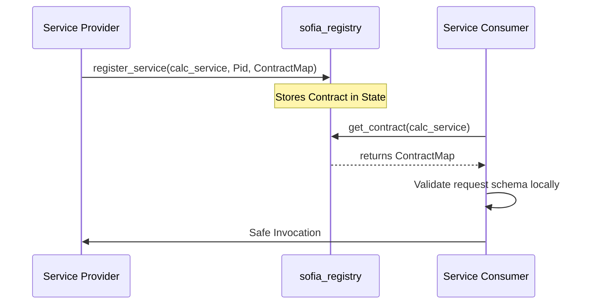

# SOFIA: Service-Oriented Federated Interoperability Architecture

SOFIA is a lightweight, Erlang-based framework designed for building scalable, fault-tolerant, and distributed service-oriented systems. Unlike traditional Service-Oriented Architecture (SOA), which relies on centralized Enterprise Service Buses (ESB) and heavy-weight orchestration engines (such as BPMN), SOFIA implements federated peer-to-peer interoperability directly at the actor level.

## Core Features

- **Federated Service Registry (`sofia_registry`)**: Fully decentralized service registration and discovery using Erlang process groups (`pg`).
- **Stateful Circuit Breaker (`sofia_breaker`)**: Low-latency, ETS-backed circuit breaker protecting distributed service calls from cascading failures.
- **Federated Configuration Sync (`sofia_config`)**: Decoupled, replicated configuration settings synchronized across nodes via lightweight cluster RPCs.
- **Protocol Gateway (`sofia_gateway`)**: Dynamic protocol bridging translating external sensor/web requests (e.g. JSON maps) into native message tuples.
- **Content-Based Router (`sofia_router`)**: Dynamic routing of service requests to specific target Pids based on payload criteria.
- **Data Transformer (`sofia_transformer`)**: Schema mapping and normalization of message parameters directly in client context.
- **Saga Orchestrator (`sofia_saga`)**: Fault-tolerant distributed transaction coordinator executing rollbacks in reverse order on failure.
- **Zero Bloat**: No centralized broker, no complex workflow orchestration engines, and no SOAP/XML overhead.

## Self-Describing Federated Services

SOFIA supports self-describing services, offering a decentralized alternative to traditional Interface Definition Languages (IDLs) like OpenAPI/Swagger or gRPC protocol buffers. Service providers register metadata contracts detailing schemas directly with `sofia_registry`. Client stubs retrieve these contracts and validate request payloads locally prior to invocation:



## Building and Compiling

To compile the SOFIA application, ensure you have Erlang/OTP 27 and `rebar3` installed. Then, run the following command from the root directory:

```bash
rebar3 compile
```

## Running Unit Tests

SOFIA utilizes EUnit to validate its core modules. Run the test suite using:

```bash
rebar3 eunit
```

## Guides and Documentation

For complete walkthroughs and domain integrations, see:
- **[Tutorial Series (tutorial/index.md)](tutorial/index.md)**: Modular step-by-step instructions on setting up local multi-node clusters, registering services, and implementing patterns.
- **[Verifiable Use Cases (Usecases.md)](Usecases.md)**: Real-world templates for water quality monitoring, industrial carbon tracking, and clinic referrals using SOFIA.


