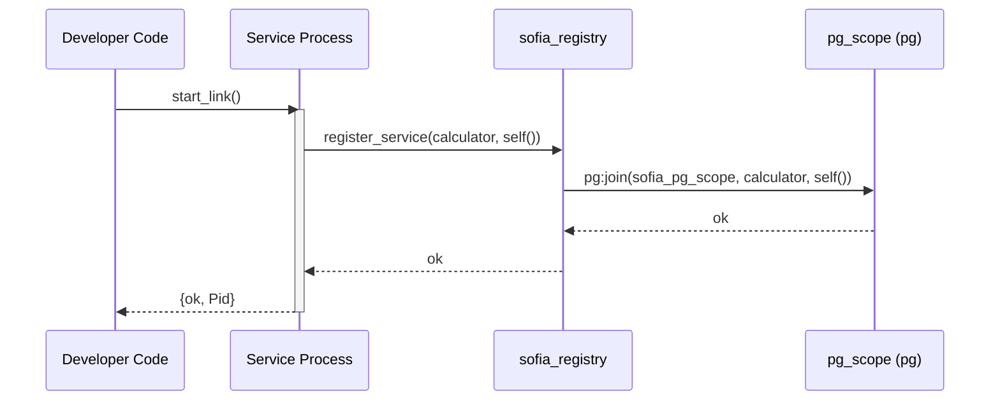

# Chapter 1: Creating and Registering Services

To participate in the SOFIA federation, a service runs as an autonomous Erlang process and registers itself with `sofia_registry`. 

## Flow Diagram

Below is the lifecycle and registration flow of a SOFIA service:



## Reusable Service Skeleton

A complete, compileable service template is provided in [sofia_service_skeleton.erl](file:///home/pradeeban/SOFIA/src/core/sofia_service_skeleton.erl). Developers can copy and extend this skeleton to implement their custom services.

## Code Example: calc_service.erl

Here is an example of a simple calculator service implemented using Erlang's standard `gen_server` behavior:

```erlang
-module(calc_service).
-behaviour(gen_server).

%% API
-export([start_link/0, add/3]).

%% gen_server callbacks
-export([init/1, handle_call/3, handle_cast/2, handle_info/2, terminate/2, code_change/3]).

start_link() ->
    gen_server:start_link(?MODULE, [], []).

add(Pid, A, B) ->
    gen_server:call(Pid, {add, A, B}).

init([]) ->
    %% Register this service process under the service type 'calculator'
    ok = sofia_registry:register_service(calculator, self()),
    {ok, unused_state}.

handle_call({add, A, B}, _From, State) ->
    {reply, {ok, A + B}, State};
handle_call(_Request, _From, State) ->
    {reply, {error, unknown_request}, State}.

handle_cast(_Msg, State) ->
    {noreply, State}.

handle_info(_Info, State) ->
    {noreply, State}.

terminate(_Reason, _State) ->
    %% Clean up registration upon termination
    ok = sofia_registry:deregister_service(calculator, self()),
    ok.

code_change(_OldVsn, State, _Extra) ->
    {ok, State}.
```
