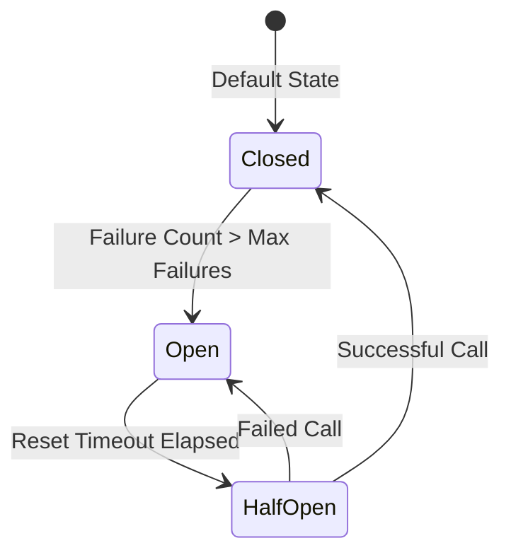

# Chapter 2: Invoking Services with Circuit Breaker Protection

When calling external or distributed services, use `sofia_breaker:call/2` (or `sofia_breaker:call/3` with options) to prevent cascading failures.

## Circuit Breaker State Machine

SOFIA circuit breakers track failures and transition through states to isolate faulty services:



## Reusable Client Stub

A reusable service client stub is provided in [sofia_client_stub.erl](file:///home/pradeeban/SOFIA/src/core/sofia_client_stub.erl). Developers can use or extend this client stub to invoke SOFIA services with built-in circuit breaker protection.

## Code Example: client_example.erl

Here is how a client discovers the calculator service and invokes it safely:

```erlang
-module(client_example).
-export([execute_addition/2]).

execute_addition(A, B) ->
    %% 1. Discover a service instance from the federated registry
    case sofia_registry:discover(calculator) of
        {error, no_service_available} ->
            {error, service_not_found};
        {ok, ServicePid} ->
            %% Define the invocation function
            InvocationFun = fun() ->
                calc_service:add(ServicePid, A, B)
            end,
            
            %% 2. Invoke the service through the circuit breaker
            %% This protects the caller if the calculator process crashes or hangs.
            %% You can pass custom thresholds: max_failures and reset_timeout (in ms)
            sofia_breaker:call(calculator_breaker, InvocationFun, #{
                max_failures => 3,
                reset_timeout => 10000
            })
    end.
```

If the calculator service fails repeatedly, the circuit breaker trips. Subsequent calls to `sofia_breaker:call` will fail immediately with `{error, circuit_open}` without hitting the remote service, saving resources and protecting your system.
