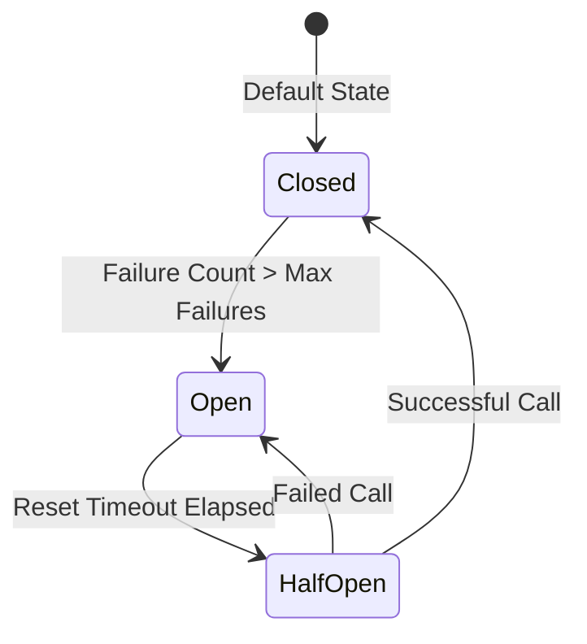

# Chapter 2: Invoking Services with Circuit Breaker Protection

When calling external or distributed services, use `sofia_breaker:call/2` (or `sofia_breaker:call/3` with options) to prevent cascading failures.

## Circuit Breaker State Machine

SOFIA circuit breakers track failures and transition through states to isolate faulty services:


```mermaid
stateDiagram-v2
    [*] --> Closed : Default State
    Closed --> Open : Failure Count > Max Failures
    Open --> HalfOpen : Reset Timeout Elapsed
    HalfOpen --> Closed : Successful Call
    HalfOpen --> Open : Failed Call
```

## Reusable Client Stub & QoS-Aware Routing

A reusable service client stub is provided in [sofia_client_stub.erl](file:///c:/Users/pkathiravelu/SOFIA/src/core/sofia_client_stub.erl). Developers can use or extend this client stub to invoke SOFIA services with built-in QoS routing and circuit breaker protection:

```erlang
%% Invoking a service using the client stub
{ok, Reply} = sofia_client_stub:call_service(calculator, {add, 10, 20}).
```

### Under the Hood: QoS Selection & Circuit Protection
When `sofia_client_stub:call_service/2` is invoked:
1. It queries `sofia_router:route/3` to discover active service instances.
2. `sofia_router` evaluates and ranks candidate processes lexicographically by circuit breaker state, mailbox depth, and historical span latency.
3. If the selected process's mailbox exceeds `max_mailbox_size`, backpressure sheds the request with `{error, overloaded}`.
4. Otherwise, the invocation is executed through `sofia_breaker:call/3`, shielding the caller from cascading failures.

## Code Example: client_example.erl

Here is how a client discovers the calculator service and invokes it safely:

```erlang
-module(client_example).
-export([execute_addition/2]).

execute_addition(A, B) ->
    %% 1. Discover a service instance from the federated registry
    case sofia_registry:discover(calculator) of
        {error, no_service_available} ->
            {error, service_not_found};
        {ok, ServicePid} ->
            %% Define the invocation function
            InvocationFun = fun() ->
                calc_service:add(ServicePid, A, B)
            end,
            
            %% 2. Invoke the service through the circuit breaker
            %% This protects the caller if the calculator process crashes or hangs.
            %% You can pass custom thresholds: max_failures and reset_timeout (in ms)
            sofia_breaker:call(calculator_breaker, InvocationFun, #{
                max_failures => 3,
                reset_timeout => 10000
            })
    end.
```

If the calculator service fails repeatedly, the circuit breaker trips. Subsequent calls to `sofia_breaker:call` will fail immediately with `{error, circuit_open}` without hitting the remote service, saving resources and protecting your system.
