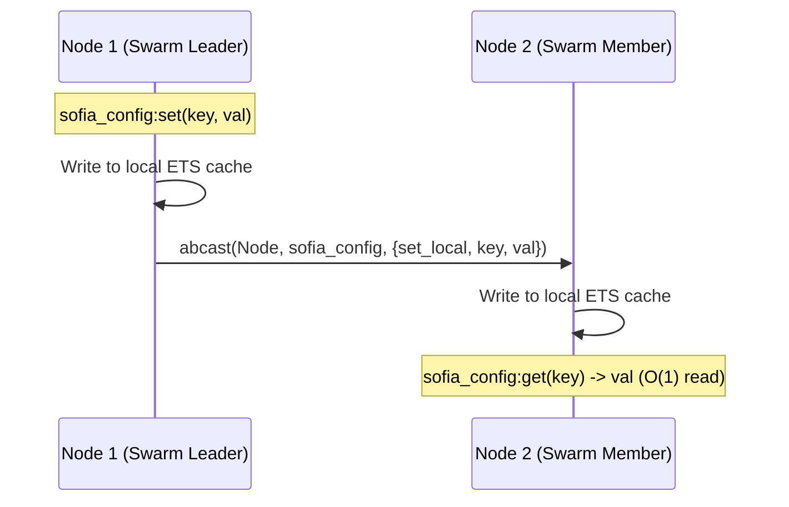

# Chapter 3: Distributed Configuration and Swarms

SOFIA syncs settings across all connected nodes automatically. When you update a setting on one node, it broadcasts to all other nodes in the Erlang cluster.

## Configuration Synchronization Flow



## Reading & Writing Configurations

### Writing a Configuration Setting
On Node 1:
```erlang
%% This sets the value locally and broadcasts it to all other connected nodes
sofia_config:set(request_timeout, 5000).
```

### Reading a Configuration Setting
On Node 2:
```erlang
%% Retrieves the value locally from the replicated ETS table in O(1) time
Timeout = sofia_config:get(request_timeout, 3000).
```

## Running a Local Multi-Node Swarm

To see the federated registry and configuration sync in action across multiple Erlang nodes on your local machine:

1. Start the first node:
   ```bash
   rebar3 shell --name node1@127.0.0.1 --setcookie sofia_cookie
   ```

2. In a separate terminal, start the second node:
   ```bash
   rebar3 shell --name node2@127.0.0.1 --setcookie sofia_cookie
   ```

3. Connect the nodes together (run this on Node 1):
   ```erlang
   net_adm:ping('node2@127.0.0.1').
   %% Returns: pong
   ```

4. Verify federated configuration sync:
   - On Node 1, run:
     ```erlang
     sofia_config:set(encryption_key, "secret-key-123").
     ```
   - On Node 2, verify the config has automatically synchronized:
     ```erlang
     sofia_config:get(encryption_key).
     %% Returns: "secret-key-123"
     ```

5. Verify federated service discovery:
   - On Node 2, start and register a calculator service:
     ```erlang
     {ok, Pid} = calc_service:start_link().
     ```
   - On Node 1, discover and call the service registered on Node 2:
     ```erlang
     {ok, RemotePid} = sofia_registry:discover(calculator).
     sofia_breaker:call(calc_breaker, fun() -> calc_service:add(RemotePid, 40, 2) end).
     %% Returns: {ok, 42}
     ```
