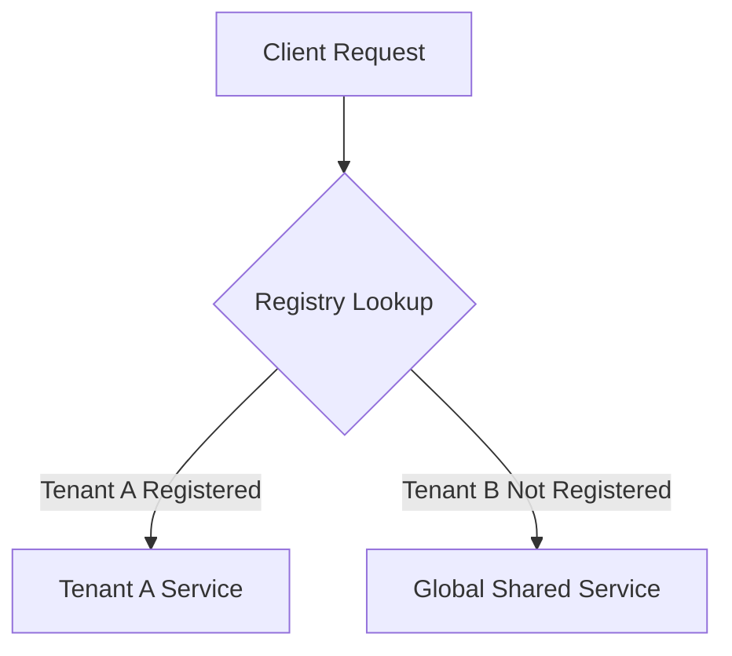
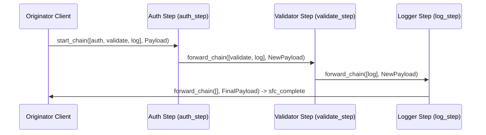

# Chapter 5: Advanced Federation Patterns

SOFIA supports advanced architectural patterns required in complex enterprise environments: service-level multitenancy isolation and decentralized service function chaining.

## 1. Abstracting Multitenancy at the Service Level

In a federated swarm, multiple tenants share infrastructure but require isolated services. SOFIA implements tenant-scoped service registries, allowing tenants to register specialized instances. If a tenant-specific instance is not available, the registry automatically routes the request to a shared global fallback instance.

### Multitenancy Routing Flow



### Code Example

Copy the implementation at [sofia_multitenant.erl](file:///home/pradeeban/SOFIA/src/patterns/sofia_multitenant.erl).

#### Registering Services
```erlang
%% Register a dedicated service instance for Tenant A
ok = sofia_multitenant:register_tenant_service(tenant_A, calc_service, TenantAPid).

%% Register a shared global fallback instance
ok = sofia_multitenant:register_tenant_service(global, calc_service, GlobalPid).
```

#### Discovering Services
```erlang
%% Returns TenantAPid
{ok, Pid1} = sofia_multitenant:discover_tenant_service(tenant_A, calc_service).

%% Tenant B is not registered specifically; automatically falls back to GlobalPid
{ok, Pid2} = sofia_multitenant:discover_tenant_service(tenant_B, calc_service).
```

---

## 2. Service Function Chaining (SFC)

Service Function Chaining (SFC) enables routing messages through a ordered sequence of virtualized network functions or services (e.g. `[auth_step, validate_step, log_step]`). 

SOFIA uses a **fully decentralized choreography-based SFC** pattern. The chain path is carried in the message envelope. Each node in the chain performs its local processing, pops itself off the chain list, discovers the next link in the chain dynamically via the registry, and forwards the message. The final node directly returns the result to the originator client.

### SFC Flow Diagram



### Code Example

Copy the implementation at [sofia_sfc.erl](file:///home/pradeeban/SOFIA/src/patterns/sofia_sfc.erl).

#### Step Service Loop
```erlang
%% Standard process loop for a service participating in chains
service_loop() ->
    receive
        {sfc_step, RemainingChain, Payload, Originator} ->
            %% Process data locally
            ProcessedPayload = process_payload(Payload),
            %% Forward down the chain
            ok = sofia_sfc:forward_chain(RemainingChain, ProcessedPayload, Originator),
            service_loop();
        stop -> ok
    end.
```

#### Initiating a Chain
```erlang
%% Start the chain execution from the client context
Chain = [auth_step, validate_step, log_step],
ok = sofia_sfc:start_chain(Chain, InitialPayload, self()),

%% Receive the final result
receive
    {sfc_complete, FinalPayload} ->
        io:format("Chain execution complete: ~p~n", [FinalPayload]);
    {sfc_error, {Service, Reason}} ->
        io:format("Chain failed at ~p: ~p~n", [Service, Reason])
end.
```
