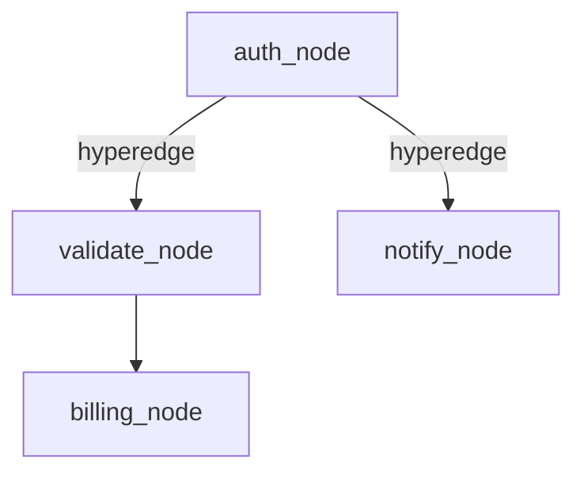

# Chapter 6: Hypergraph Service Workflows

SOFIA supports dynamic workflow definitions in the form of **directed hypergraphs**. A hyperedge can connect a single source node to multiple destination nodes, enabling parallel branching execution paths (fan-out / fork joins) across federated actors.

Users define these topologies in YAML notation. The workflow engine parses this structure, and the service actors orchestrate execution dynamically.

## Workflow Topology Diagram

Below is the workflow graph represented in the YAML example, showing parallel fan-out routing at `auth_node`:



## YAML Representation

A directed hypergraph workflow is represented in a clean, human-readable YAML notation:

```yaml
name: billing_workflow
- source: auth_node
  destinations:
    - validate_node
    - notify_node
- source: validate_node
  destinations:
    - billing_node
```

## Code Example

Copy the implementation at [sofia_workflow.erl](file:///home/pradeeban/SOFIA/src/patterns/sofia_workflow.erl).

### Workflow-Aware Actor Loop
```erlang
actor_loop() ->
    receive
        {workflow_step, Workflow, Node, Payload, Ref, Originator} ->
            %% 1. Perform local task execution
            UpdatedPayload = Payload ++ [local_action],
            
            %% 2. Delegate the next transition to the workflow coordinator.
            %% This dynamically resolves the next hops from the parsed hyperedges.
            ok = sofia_workflow:complete_step(Workflow, Node, UpdatedPayload, Ref, Originator),
            actor_loop();
        stop -> ok
    end.
```

### Parsing and Initiating Workflow Execution
```erlang
%% 1. Parse the workflow specification
YamlStr = "
name: billing_workflow
- source: auth_node
  destinations:
    - validate_node
    - notify_node
- source: validate_node
  destinations:
    - billing_node
",
{ok, Workflow} = sofia_workflow:parse_yaml(YamlStr),

%% 2. Run the workflow starting at auth_node
ok = sofia_workflow:execute(Workflow, auth_node, [initial_data], self()),

%% 3. Receive responses from fanned-out leaf nodes
%% Since notify_node and billing_node have no outgoing edges, they report final branch results.
receive
    {workflow_branch_complete, LeafNode, ResultPayload, _Ref} ->
        io:format("Branch at ~p finished: ~p~n", [LeafNode, ResultPayload])
end.
```
