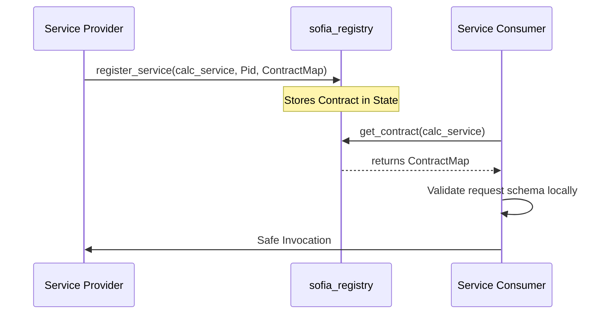

# Chapter 7: Self-Describing Federated Services

To compete with modern web services standards (like OpenAPI, gRPC, and SOAP), SOFIA supports **Self-Describing Services** using decentralized contracts. This bridges the interface description gap in federated actor networks.

Each service provider publishes a contract map during registration. Client stubs retrieve this contract and validate request payloads locally prior to dispatching them over the network.

---

## 1. Architectural Blueprint for Self-Describing SOFIA Services

Below is the message sequence showing schema validation at the client boundary:



---

## 2. Defining a Service Contract

Contracts are defined as standard nested Erlang maps containing method schemas:

```erlang
Contract = #{
    methods => #{
        add => #{
            input_schema => #{
                a => integer,
                b => integer
            }
        }
    }
}
```

Supported schema data types for fields include:
- `integer`
- `float`
- `number`
- `binary`
- `list`
- `map`
- `boolean`
- `string` (Erlang string type checks)

---

## 3. Registering and Invoking with Contracts

### Provider Registration
Providers register their contract maps along with their process identifier:
```erlang
ok = sofia_registry:register_service(calc_service, self(), Contract).
```

### Consumer Invocation (with Client-Side Validation)
When invoking a service via `sofia_client_stub`, the stub automatically retrieves the contract from `sofia_registry` and validates the request:
```erlang
%% Valid request -> returns {ok, 15}
Result1 = sofia_client_stub:call_service(calc_service, {add, #{a => 5, b => 10}}).

%% Missing parameter -> returns {error, {contract_validation_failed, {missing_parameter, b}}}
Result2 = sofia_client_stub:call_service(calc_service, {add, #{a => 5}}).

%% Type mismatch -> returns {error, {contract_validation_failed, {type_mismatch, b, integer, <<"not_an_integer">>}}}
Result3 = sofia_client_stub:call_service(calc_service, {add, #{a => 5, b => <<"not_an_integer">>}}).
```
